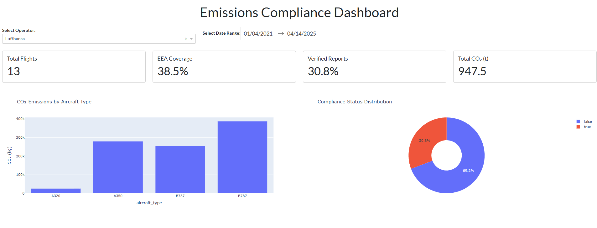

# ✈️ Aviation Emissions Compliance Register

## What's this project about?
Welcome! This project was built to explore and explain aviation-related climate data through simulation, automation, and transparency. It simulates and monitors flight-level CO₂ emissions from aviation operators and evaluates their compliance with the EU Emissions Trading System (EU ETS). Even without real-world datasets, it enables rapid assessments and visibility into regulatory obligations using realistic synthetic data.

This project was developed not only as a technical solution but also as a learning platform - a space to explore sustainable aviation metrics, build scalable tools, and share reproducible insights.

You can explore the live dashboard here: [https://aviation-emissions-compliance-register.onrender.com/](https://aviation-emissions-compliance-register.onrender.com/)

---

## Features
- Generate daily synthetic flight data with emissions and SAF blend levels
- Assess flight compliance based on EEA routing and operator status
- Store data in a structured SQLite database
- Automatically create Word and CSV reports
- Visualise emissions and compliance trends
- Maintain a growing summary log of emissions data
- Public interactive dashboard hosted via Render

---

## What's under the hood?
- **Language**: Python 3
- **Data & Storage**: pandas, SQLite
- **Visualisations**: plotly, dash
- **Dashboards**: Dash with Bootstrap styling
- **Reporting**: python-docx
- **Automation**: argparse, logging
- **DevOps**: Render (for deployment and hosting)

---

## CI Integration

This project includes a [GitHub Actions](https://docs.github.com/en/actions) continuous integration workflow that runs on every push and pull request. It:

- Verifies Python syntax using `py_compile`
- Enforces consistent formatting with [`black`](https://black.readthedocs.io/en/stable/)
- Installs dependencies from `requirements.txt` to validate environment integrity

The CI pipeline helps ensure code quality and maintainability throughout development.

---

## Data Sources & Assumptions
Transparency is essential - especially when simulating environmental impacts. The assumptions below are clearly declared and traceable through the source code and output reports:
- Simulated data using real-world aircraft fuel economy (Wikipedia)
- Standard emission factor: 3.16 kg CO₂ per kg Jet A-1 fuel
- SAF blending assumptions: 0-50% (ASTM D7566 standards)
- Predefined European airport codes and operators

### Sustainable Aviation Fuel (SAF)
This simulation includes SAF blending ratios from 0 to 50 percent, following ASTM D7566 standards. Emissions are reduced in direct proportion to the SAF blend percentage. For example, a 40 percent SAF blend results in 40 percent lower direct CO₂ emissions, assuming SAF is carbon-neutral at the point of combustion. Although real SAF types vary in their life-cycle emissions, this linear reduction is a common simplification in early-stage compliance tools.

---

## Getting Started

### 1. Install Requirements
```bash
pip install -r requirements.txt
```

### 2. Run Daily Simulation & Import
```bash
python code/main.py
python code/import_to_sqlite.py --report_date 2025-05-01
```

### 3. Use Full Pipeline Runner
Instead of running steps manually, you can run everything (data generation + import + reporting) with:

```bash
python run_all.py --report_date 2025-05-01
```
This runs:
- `main.py` to simulate flight data
- `import_to_sqlite.py` to generate and store reports

### 4. Launch Dashboard Locally (Optional)
```bash
python code/emissions_dashboard.py
```

Or view it online: [aviation-emissions-compliance-register.onrender.com](https://aviation-emissions-compliance-register.onrender.com/)

---

## Project File Structure
Below is a typical folder layout, generated during regular operation. It promotes clarity, reproducibility, and auditability:
```
aviation-emissions-compliance-register/
├── code/
│   ├── __init__.py              # Package marker
│   ├── main.py                  # Simulates flight data
│   ├── import_to_sqlite.py     # Imports, reports, visualises
│   ├── emissions_dashboard.py  # Dash dashboard
│   └── config/                 # Static JSON configs
├── data/
│   └── emissions.db            # SQLite database
├── output/
│   ├── flights_YYYY-MM-DD.csv  # Simulated flight data
│   └── .imported_files.txt     # Import tracking
├── reports/
│   ├── YYYY-MM-DD/             # Daily report folder
│   │   ├── summary.docx
│   │   ├── summary_YYYY-MM-DD.csv
│   │   ├── emissions_by_aircraft.png
│   │   └── compliance_pie.png
│   └── summary_log.csv         # Rolling summary
├── requirements.txt
├── .github/
│   └── workflows/
│   │   ├── python-ci.yaml
└── README.md
```

---

## Scalability & Transparency

This project is designed to be easily extended, both in terms of functionality and scope:

- **Scalable architecture**: All components are modular - simulation, processing, database storage, and dashboarding - making it easy to plug in new data sources or reporting layers.
- **Transparent logic**: Emissions calculations, compliance rules, and assumptions are implemented in clearly commented code and reproducible steps. Synthetic data generation is based on published fuel consumption figures, and each transformation step is logged and reportable.
- **Traceability**: Daily reports are versioned by date and retained as Word, CSV, and visual formats.
- **Audit-readiness**: Data is persistently stored in SQLite with import timestamps, and all summary statistics are logged to an append-only `summary_log.csv`.
- **Accessible dashboard**: Hosted on Render at [https://aviation-emissions-compliance-register.onrender.com](https://aviation-emissions-compliance-register.onrender.com) for convenient public access.

---

## Outputs


*Example view from the interactive Dash dashboard. All data is simulated and does not reflect actual airline performance.*

- `summary_YYYY-MM-DD.csv`: Daily KPI export
- `summary.docx`: Emissions report with charts
- `summary_log.csv`: Appended daily summary for trend analysis
- PNG plots: Emissions by aircraft, compliance breakdown

---

## Future Improvements
- Integrate real-world API data (Eurocontrol, ICAO)
- Add emissions offset calculations and cost estimations
- Schedule automated deployment and monitoring
- Email or archive daily reports automatically
- Switch to [Polars](https://www.pola.rs/) for faster processing on large datasets
- Improve dashboard interactivity (e.g., maps, airline drilldowns)
- Add usage logging or access analytics to monitor dashboard reach

---

## About the Author
Daniel Lee Wilkinson   
[LinkedIn](https://www.linkedin.com/in/danielleewilkinson/)

